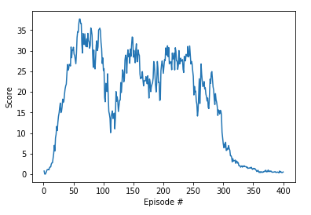

## Learning Algorithm
I used Udacity's implementation of DDPG in the official Github repository
https://github.com/udacity/deep-reinforcement-learning as starting point. In discussions with fellow
classmates on the DRLND Slack channel, it was reported to have excellent performance for this task. 

I have not changed the basic architecture of the Udacity implementation. This means that the following
hyperparameters have been used for all experiments (and were hence 
not included in the hyperparameter tuning section):

- 2 layer network for actor and critic
- ReLU activation function
- tanh layer as output
- replay buffer_size = 10000
- batch size = 128 
- discount factor = 0.99            
- soft update tau = 0.001  
- learning rate for actor = 1e-4    
- learning rate for critic =  1e-4        
- L2 weight_decay = 0 
- seed = 0

### Hyperparameters
Since hyperparameter tuning is quite expensive in RL, I've only varied the number of 

| Hyperparameter        |  Value   |
| ------------- |  ------------ |
| Actor Layer 1 |   200, 256, 400 |
| Actor Layer 2 |   100, 128, 300 |
| Critic Layer 1|   200, 256, 400 |
| Critic Layer 2|   100, 128, 300 |
| Ornstein-Uhlenbeck sampling distribution  |  uniform, normal | 
| Ornstein-Uhlenbeck sigma parameter |  0.15, 0.2, 0.25. 0.3  |

Of these choices, the biggest impact on performance has been observed when 
changing the Ornstein-Uhlenbeck sampling distribution from a 
uniform distribution to a normal distribution.

### Results 
The environment was solved after 108 episodes with the following hyperparameters: 

| Hyperparameter        |  Value   |
| ------------- |  ------------ |
| Actor Layer 1 |   256 |
| Actor Layer 2 |   128 |
| Critic Layer 1|   256 |
| Critic Layer 2|   128 |
| Ornstein-Uhlenbeck sampling distribution  |  normal | 
| Ornstein-Uhlenbeck sigma parameter |  0.2 |

#### Plot of Rewards vs Number of Episode

### Ideas for Future Work
The performance we have achieved is quite good. Of course, it's always possible to perform more 
more hyperparameter tuning or to try out a different algorithm altogether. It's also possible 
to try something like epsilon-decay for the Ornstein-Uhlenbeck process to reduce the amount
of exploration done with time, but given that hyperparameter 
tuning is expensive and time-consuming and that this version and implementation of 
DDPG performed so well, I see no reason to tweak the 
current implementation too much.